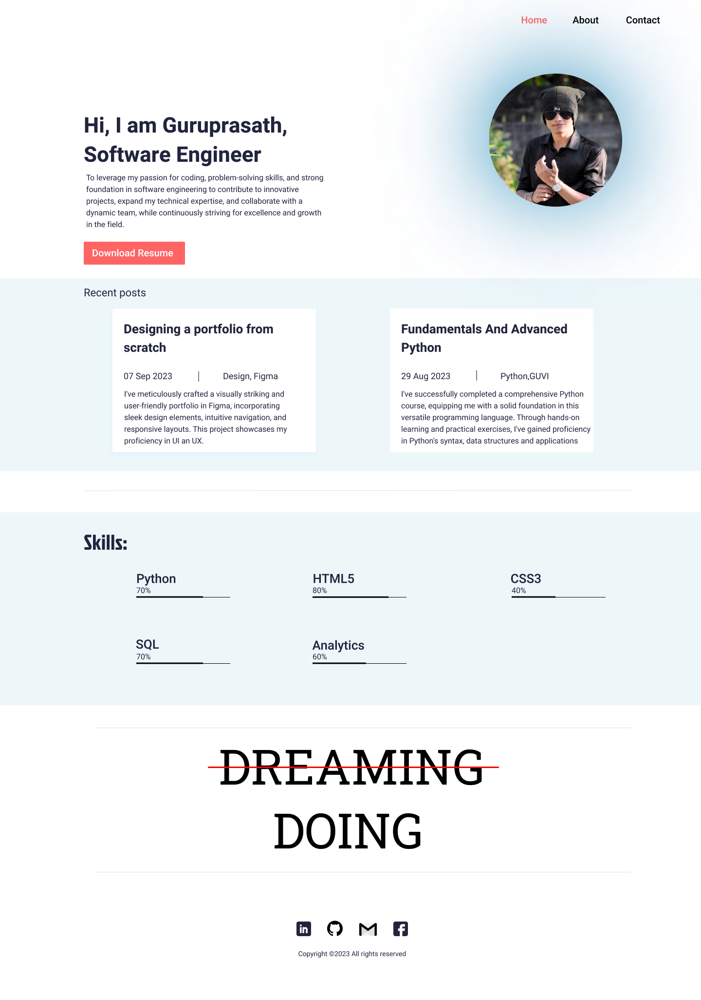
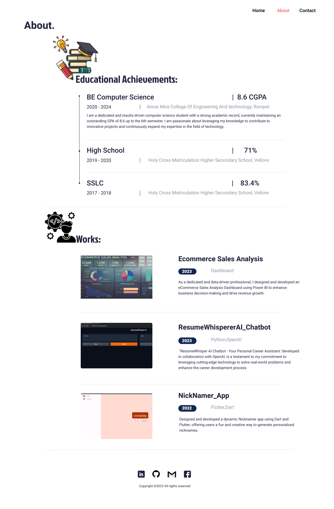
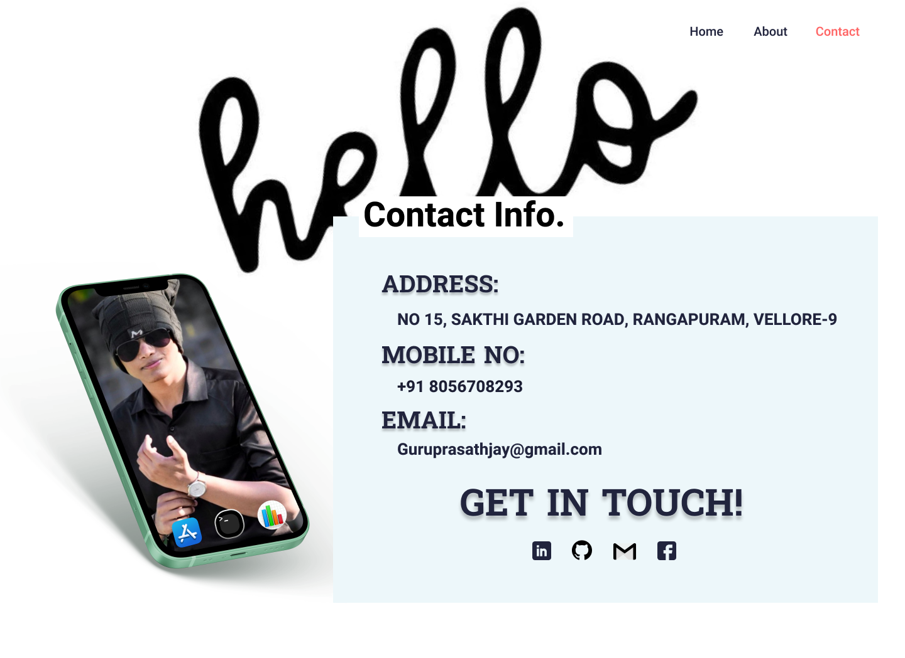

# personal_portfolio

# Personal Portfolio Website
# Website Preview Home Page

# About Page 

# Contact Page


This repository contains the source code for my personal portfolio website built using HTML and CSS. This website serves as a showcase of my skills, projects, and achievements. Feel free to explore the code and use it as a reference for your own portfolio website.

## Features

- **Responsive Design:** The website is designed to be fully responsive, ensuring a seamless experience on various devices, including desktops, tablets, and smartphones.

- **Project Galleries:** Explore my work through organized project galleries, complete with descriptions, images, and links to each project.

- **Contact Information:** Get in touch with me easily through the provided contact information.

- **Resume Download:** Download a PDF version of my resume to learn more about my qualifications.

## Technologies Used

- HTML5: Used for structuring the web pages.
- CSS3: Used for styling and layout.
- Responsive Design: Ensures compatibility across different screen sizes.
- [Optional] JavaScript: Used for interactivity and animations.

## Usage

1. Clone the repository:

   ```bash
    git clone 
